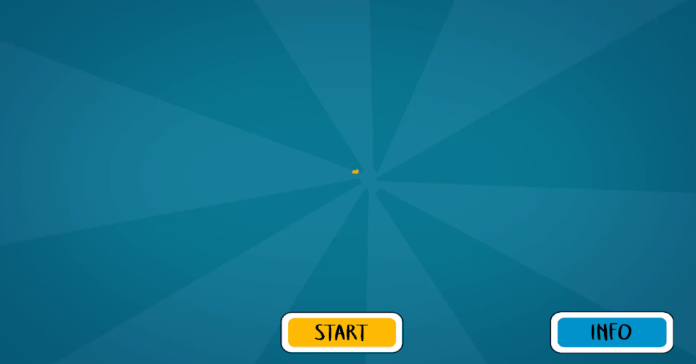
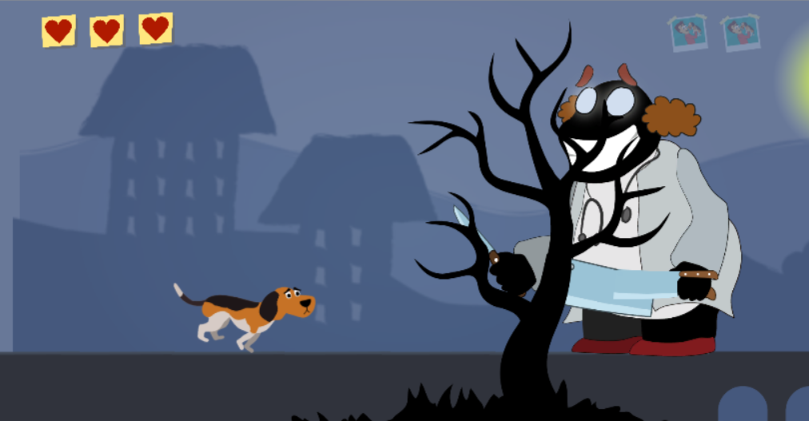

# Where are you ?

## Description
I introduce you to Where are you? But why Where are you, in English? Actually, it sounds cool more in English. But first we present the game of Where are you? It is about a puppy very dear to its owner, every day there were moments of joy and affection. A curious fact is that the owner gave him a very special name for his puppy, Tobby. One day Tobby was very sad because his owner never returned home, and that same day it was raining. Tobby was very sad begins to think what could be happened to his owner, until one day he very bravely goes out to look for his owner. Can you help the poor Tobby recover his beloved owner and find out what happened with him? Tobby will need your help! Without you, Tobby will not be able to achieve it!
## Controllers
- <kbd>&uarr;</kbd> keys to jump

## Gameplay demo

### Introduction

  

### Big boss

  

## Artist designer
William Arias Zúñiga

## Programmers
Danny Xie Li 
Gabriel Ramirez Cruz
